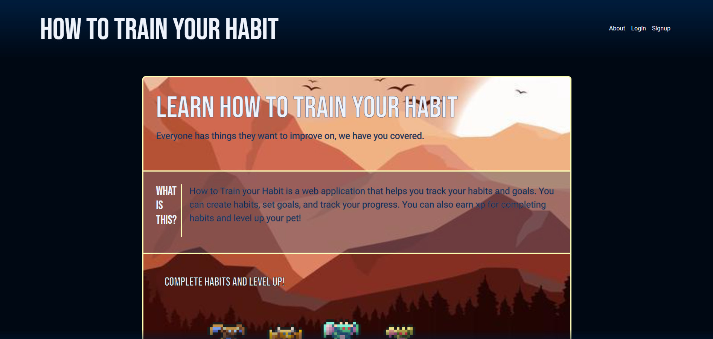
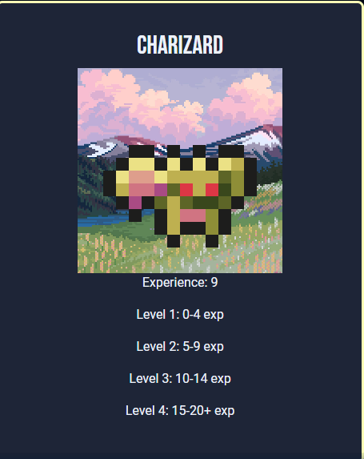

# Habit Tracker

## Table of Contents

 [General Information](<#General Information>)
 [Technologies](#Technologies)
 [Links](#Links)
 

## General Information
The Habit Tracker allows you to track habits while leveling up a pet. From the Home page you can sign up or login. Once you have signed up or logged in you will be able to go to your Dashboard and add/remove habits. Once you have your habits all set you can set to when you would like to have the habit completed by. When the
what, why and how

application use?

Why would you use this app?

How to use the app

## Technologies
enter here

## Images

image of application

github link and repo

questions
