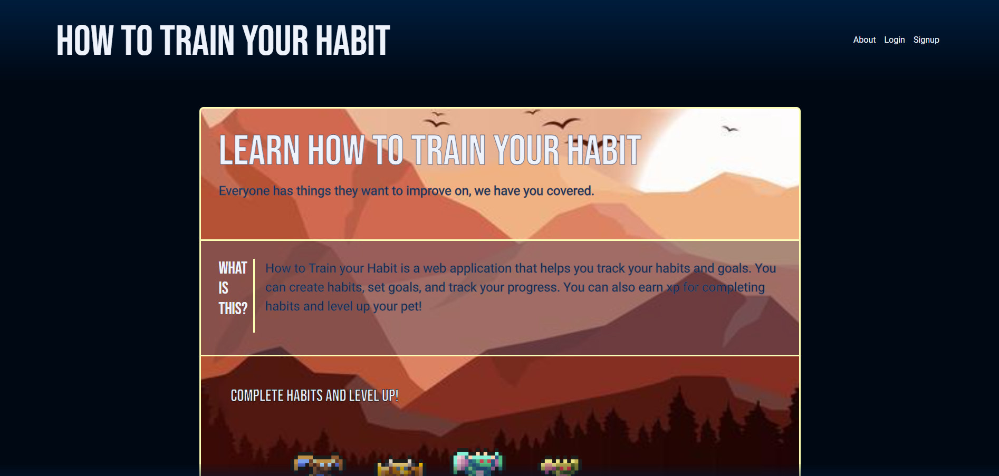
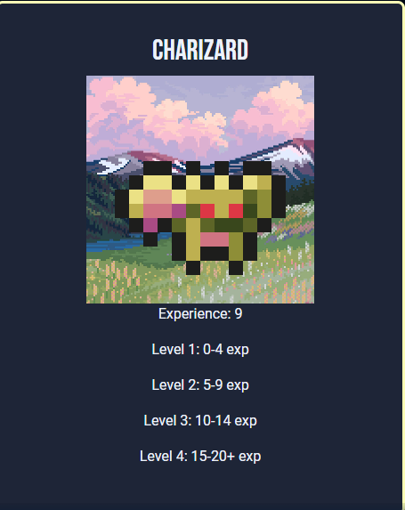

# Habit Tracker

## Table of Contents

 1. [Description](<#Description>)
 1. [Usage](<#Usage>)
 1. [Installation](#Installation)
 1. [Technologies](#Technologies)
 1. [Images](#Images)
 1. [Contributor GitHub links](<#Contributor GitHub Links>)

## Description
The Habit Tracker is a web application that allows you to track habits while leveling up a pet. From the Home page you can sign up or login. Once you have signed up or logged in you will be able to go to your Dashboard and add/remove habits. As you complete the habits before or on the day they are scheduled to be completed, your pet will gain experience points and level up. There is an about page that talks about the psychology of building habits along with tips on forming good habits and breaking bad habits. Psychology shows that using a reward as a motivation to complete a habit, such as leveling up and evolving your own pet can keep you motivated and more likely to succeed.

## Usage
Navigate to [this webpage](https://how-to-train-your-habit-6d1d2b04622a.herokuapp.com/). Sign up or login if you already have an account. Use the dashboard to create a pet and add habits. Use the habits page to see your scheduled habits. Click on a habit to mark it as complete. This will add experience points to your pet. Earn enough experience to see your pet evolve.

## Installation
Clone the repository. Make sure you have node.js and MySQL installed. Run `npm i` in your terminal. Edit your .env.EXAMPLE file with the required variables. Source the schema found in db/schema.sql. Type `npm run seeds` in your terminal to seed the database. Finally type `npm run watch` to start the express server. Navigate to http://localhost:3001/ to view the webpage.

## Technologies
1. Web Server: Express.js
1. ORM: Sequelize
1. Database: MySQL
1. Password Encryption: Bcrypt
1. Template Engine: Handlebars
1. Date Library: Date-fns
1. Browser ESM - using Ecmascript modules inside the browser.

## Images

## Contributor GitHub Links
1. [Larry](https://github.com/larwis95)
1. [Fon](https://github.com/FonKnp)
1. [Seth](https://github.com/seth89)

